# DATA ANALYST

### PROJECTS

3. [Study of music platform activity by days of the week in two different cities.](https://github.com/mrefugionv/S3----MUSIC-)\
Language: Python - Pandas.\

 Proportions of listeners in each city by weekday 

  

    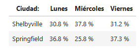
  

  
4. [Using visualizations, answer  business questions of a grocery delivery platform.](https://github.com/mrefugionv/S4--INSTACART)\
Language: Python - Pandas, Matplotlib.\

Prefered hours to order

 

    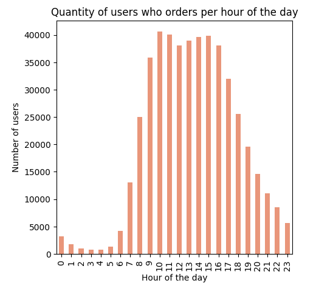
  

  
5. [Which prepaid tariff generates more revenue for the telecommunications operator?](https://github.com/mrefugionv/S5----MEGALINE)\
Hypothesis test by statistical methods.\
Language: Python - Scipy, Seaborn, Matplotlib, Pandas.\

Payment Mean for Surf and Ultimate Plans - Bar Plot

 

    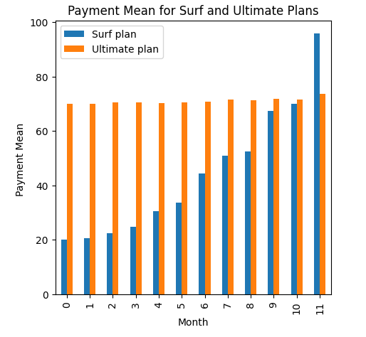
  

6. [Sales forecasting for the online video game store.](https://github.com/mrefugionv/S6---ICE-VIDEOJUEGOS)\
Statistical analysis, visualizations and hypothesis testing.\
Language: Python - Scipy, Seaborn, Matplotlib, Pandas.\

Platform popularity over time - Histogram

 

    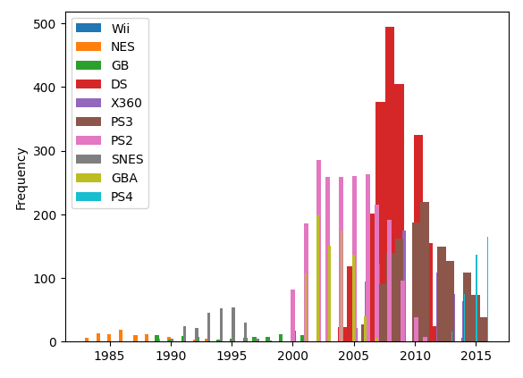
  

7. [Build and deploy a web application control panel on a cloud service. Car sales advertisement dataset.](https://github.com/mrefugionv/SPRINT-7---PROYECTO)\
Tools: Render. Python - Streamlit. VS Code. GitHub.\

Web application overview

 

    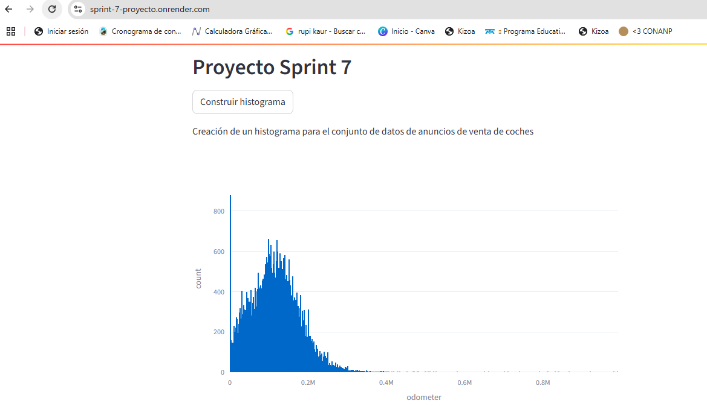
  

8. [Impact of weather on passenger preference for a cab travel company.](https://github.com/mrefugionv/S8---ZUBER)\
Languages: SQL queries.  Python- Requests, BS4 : Extraction of information from HTML web sites.\

Table diagram for the dataset

 

    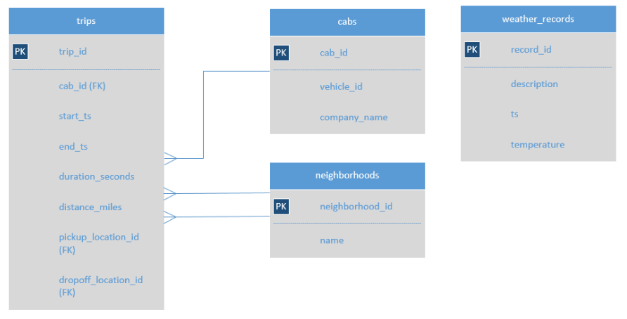
  

  
9. [Help optimize marketing spend for Showz, an event ticketing company. Cohort analysis, KPI calculations (business metrics) and heatmap visualization.](https://github.com/mrefugionv/S9---SHOWZ)\
Languages: Python - Pandas, Seaborn, Datetime. \

ROMI per marketing channel

 

    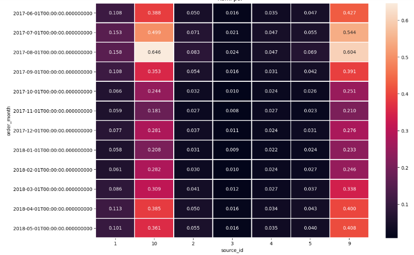
  

  
10. [Launch and A/B test analysis for an online store.](https://github.com/mrefugionv/S10----PRUEBA-A-B-TIENDA-ONLINE)\
Framework prioritization of hypotheses, cumulative metrics, percentiles and Mann-Whitney statistical method.\
Language: Python - Scipy, Seaborn, Matplotlib, Pandas, Datetime.\

Cumulative income per group A/B

 

    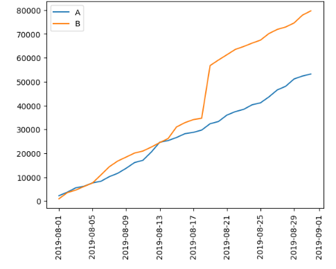
  

  
11. [A/A/B test for typography change in a food company application.](https://github.com/mrefugionv/S11---ALIMENTOS_PRUEBA_AAB)\
Language: Python - Scipy, Seaborn, Matplotlib, Pandas, Datetime.\

Purchase Funnel

 

    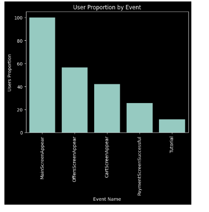
  

  
12. Automation of dashboard to solve frequently asked questions for the advertising team about the most viewed video categories.\
Tool: Tableu Public.\

Dashboard Preview

 

    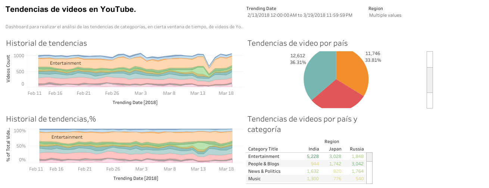
  

  
13. Prediction of the probability of loss (for the next month) for each client of the Model Fitness gym. Machine Learning.\
Language: Python - ScikitLearn , Pandas.  \

Clusters Dendogram

 

    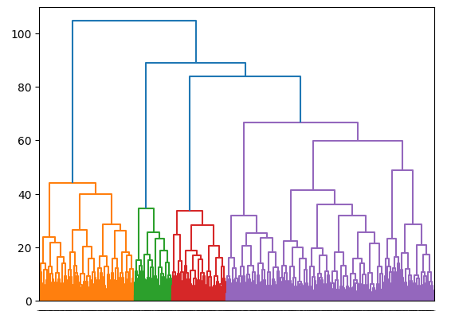
  

  
14. Generate a value proposition for a new product to a book application.\
Language: SQL queries. \

Table diagram for the dataset

 

    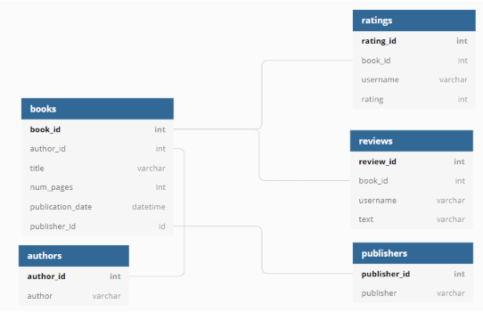
  

  
14.  A/B testing of changes related to the introduction of an improved recommendation system in an online store.\
Language: Python - Scipy, Seaborn, Matplotlib, Pandas, Datetime.\

Daily and cumulative values for each stage of the purchase funnel - Login as an example

 

    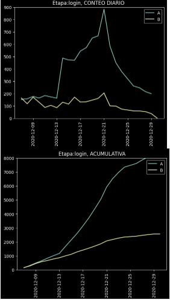
  

  
14. Identifying the least efficient operators in a telecommunications company; and Dashboard creation.\
Language: Python - Scipy, Seaborn, Matplotlib, Pandas, Datetime.\

Outliers Analysis

 

    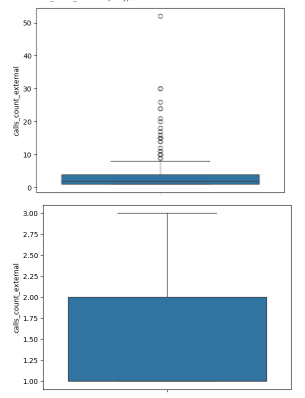
  

  
Language: Tableu 

Dashboard preview

https://public.tableau.com/views/ProyectoTelecomunicaciones_17489125856570/Dashboard1?:language=en-US&publish=yes&:sid=&:redirect=auth&:display_count=n&:origin=viz_share_link
 

    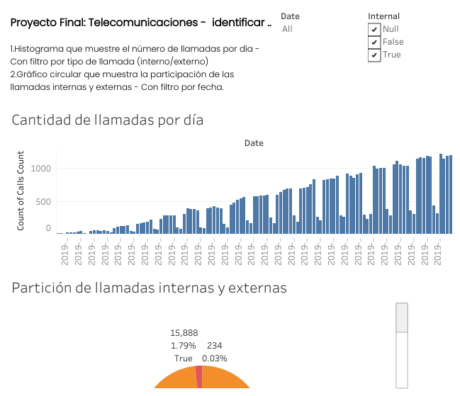
  

